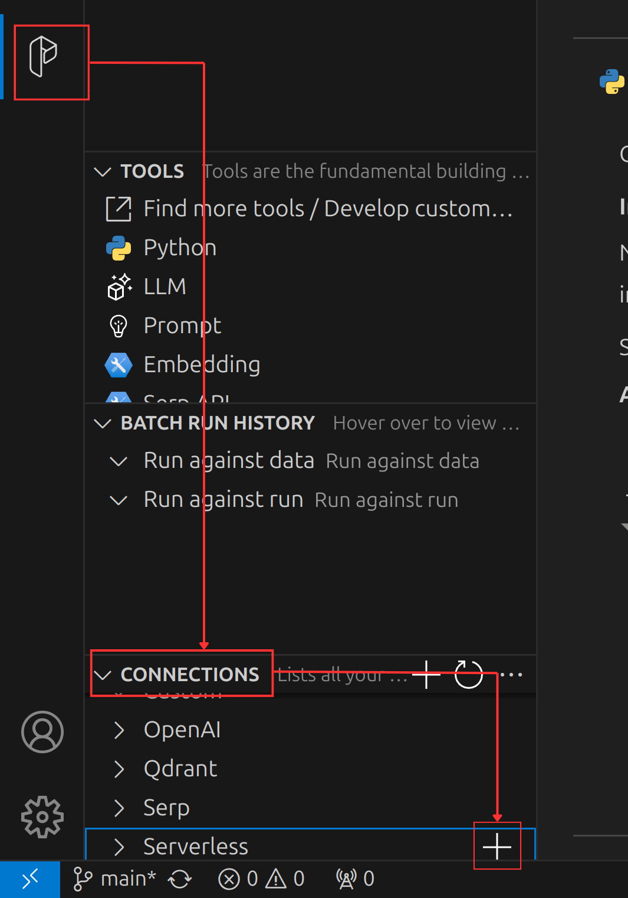

# Prompt Flow with Local LLM

The repository is intended to serve as a quick-start guide for using PromptFlow with a locally running OpenAI-compatible server, rather than using the OpenAI API. Install the dependencies using `poetry install` before running the flows. There are two parts to this repository:

## 1. Flow Using a Prompty File

The code is located in the `prompty` directory. As long as you have the server running as specified in the `prompty/.env` file, it should run without any issues. To run the code, execute the following command in the terminal:
```shell
pf flow test --flow prompty/flow:chat --inputs question="What's the capital of France?"
```

## 2. DAG Flow Using YAML

The code is located in the `flow` directory. You need to create a connection before running this flow. Install the PromptFlow extension in VS Code and click the button shown below:


Then, update the values as follows (The `api_base` URL should point to your server):
```yaml
$schema: https://azuremlschemas.azureedge.net/promptflow/latest/ServerlessConnection.schema.json
name: local_llm
type: serverless
api_key: "<user-input>"
api_base: "http://localhost:11434/v1"
```
Afterward, execute the flow using the following command:
```shell
pf flow test --flow flow --inputs url="https://w.wiki/CdVc"
```
